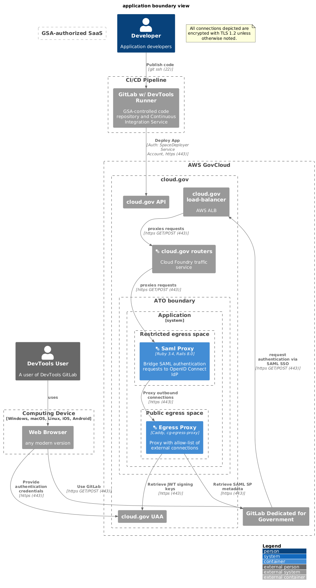

# Application boundary view



```plantuml
@startuml
!include https://raw.githubusercontent.com/plantuml-stdlib/C4-PlantUML/master/C4_Container.puml
' uncomment the following line and comment the first to use locally
' !include C4_Container.puml
LAYOUT_WITH_LEGEND()
title application boundary view

Person_Ext(public, "DevTools User", "A user of DevTools GitLab")
Person(developer, "Developer", "Application developers")

Boundary(device, "Computing Device", "Windows, macOS, Linux, iOS, Android"){
    System_Ext(browser, "Web Browser", "any modern version")
}
Rel(public, browser, "uses", "")

note as EncryptionNote
All connections depicted are encrypted with TLS 1.2 unless otherwise noted.
end note
Boundary(aws, "AWS GovCloud") {
    System_Ext(gdg, "GitLab Dedicated for Government")
    Boundary(cloudgov, "cloud.gov") {
        System_Ext(cg_api, "cloud.gov API")
        System_Ext(cg_uaa, "cloud.gov UAA")
        System_Ext(aws_alb, "cloud.gov load-balancer", "AWS ALB")
        System_Ext(cloudgov_router, "<&layers> cloud.gov routers", "Cloud Foundry traffic service")
        Boundary(atob, "ATO boundary") {
            System_Boundary(inventory, "Application") {
                Boundary(restricted_space, "Restricted egress space") {
                    Container(app, "<&layers> Saml Proxy", "Ruby 3.3.6, Rails 8.0.2", "Bridge SAML authentication requests to OpenID Connect IdP")
                }
                Boundary(egress_space, "Public egress space") {
                    Container(proxy, "<&layers> Egress Proxy", "Caddy, cg-egress-proxy", "Proxy with allow-list of external connections")
                }
            }
        }
    }
}

Boundary(gsa_saas, "GSA-authorized SaaS") {
}

Boundary(cicd, "CI/CD Pipeline") {
    System_Ext(gitlabci, "GitLab w/ DevTools Runner", "GSA-controlled code repository and Continuous Integration Service")
}

Rel(browser, gdg, "Use GitLab", "https GET/POST (443)")
Rel(gdg, aws_alb, "request authentication via SAML SSO", "https GET/POST (443)")
Rel(aws_alb, cloudgov_router, "proxies requests", "https GET/POST (443)")
Rel(cloudgov_router, app, "proxies requests", "https GET/POST (443)")
Rel(developer, gitlabci, "Publish code", "git ssh (22)")
Rel(gitlabci, cg_api, "Deploy App", "Auth: SpaceDeployer Service Account, https (443)")
Rel(app, proxy, "Proxy outbound connections", "https (443)")
Rel(proxy, cg_uaa, "Retrieve JWT signing keys", "https (443)")
Rel(browser, cg_uaa, "Provide authentication credentials", "https (443)")
@enduml
```

### Notes

* See the help docs for [C4 variant of PlantUML](https://github.com/RicardoNiepel/C4-PlantUML) for syntax help.
