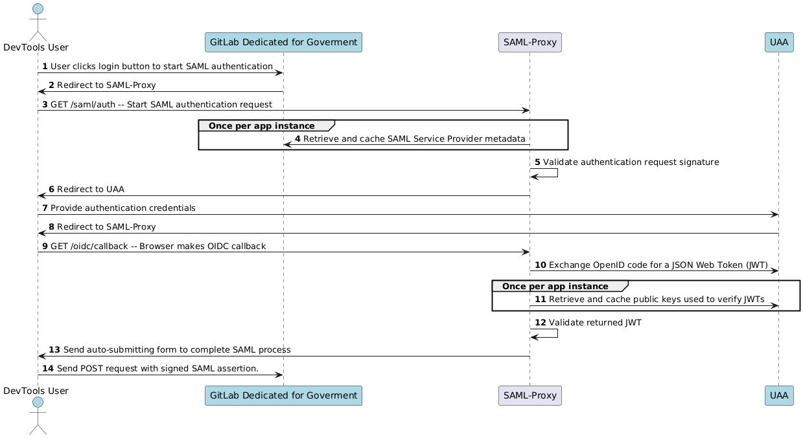
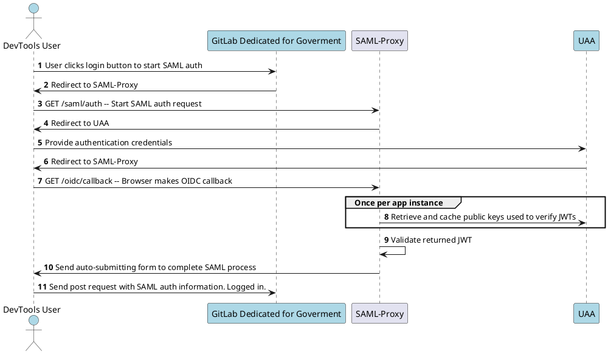

# Data Flow Diagram

```plantuml
@startuml
Actor "DevTools User" as User #add8e6
Participant "GitLab Dedicated for Goverment" as GDG #add8e6
Participant "SAML-Proxy" as SP
Participant "UAA" #add8e6

autonumber

User -> GDG : User clicks login button to start SAML auth
GDG -> User : Redirect to SAML-Proxy
User -> SP : GET /saml/auth -- Start SAML auth request
SP -> User : Redirect to UAA
User -> UAA : Provide authentication credentials
UAA -> User : Redirect to SAML-Proxy
User -> SP : GET /oidc/callback -- Browser makes OIDC callback
group Once per app instance
SP -> UAA : Retrieve and cache public keys used to verify JWTs
end
SP -> SP : Validate returned JWT
SP -> User : Send auto-submitting form to complete SAML process
User -> GDG : Send post request with SAML auth information. Logged in.
@enduml
```

### Notes

* See the help docs for [PlantUML Sequence Diagrams](https://plantuml.com/sequence-diagram) for syntax help.
